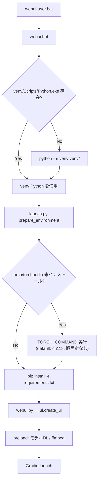

# WORKLOG: rvc-webui Blackwell 対応

作業ブランチ: `feature/blackwell-support`  
最終更新: 2026-06-13  
対象リポジトリ: ddPn08/rvc-webui フォーク（origin: `m1kitaro/rvc-webui`）

---

## Step 1: 現状把握（コード変更なし）

### 1-1. 起動・インストール機構（最重要）

#### 起動チェーン全体

```
webui-user.bat
  └─ call webui.bat
       ├─ [venv 作成/再利用]
       └─ %PYTHON% launch.py %*
            ├─ prepare_environment()  … 依存インストール
            └─ start()                … webui.py 起動
                 └─ ui.create_ui() → preload() → Gradio Blocks
```

**Windows 正規起動経路**

| 段階 | ファイル | 役割 |
|------|----------|------|
| ユーザー設定 | `webui-user.bat` | `PYTHON`, `GIT`, `VENV_DIR`, `COMMANDLINE_ARGS` を上書き可能（現状はすべて空＝デフォルト） |
| シェル | `webui.bat` | Python/pip 確認 → venv 作成/有効化 → `launch.py` 実行 |
| インストール | `launch.py` | torch インストール → `requirements.txt` インストール |
| アプリ | `webui.py` | `modules.ui.create_ui()` → Gradio 起動 |

**Linux/Mac 正規起動経路**

```
webui-user.sh (任意) → webui.sh → venv 作成/activate → launch.py
```

`webui.sh` は AMD GPU 時のみ `TORCH_COMMAND` を ROCm 用に上書き（79–82 行）。Windows 側には同等ロジックなし。

#### webui.bat の venv 処理

- **デフォルト venv パス**: `VENV_DIR=%~dp0venv`（リポジトリ直下 `venv/`）
- **作成条件**: `%VENV_DIR%\Scripts\Python.exe` が存在しなければ `%PYTHON% -m venv "%VENV_DIR%"` で新規作成
- **再利用条件**: 上記 Python.exe が存在すればその venv を使い続ける（バージョン検証・再作成なし）
- **venv スキップ**:
  - `VENV_DIR=-` → venv 不使用
  - `SKIP_VENV=1` → venv 不使用
- **Python 指定**: 環境変数 `PYTHON`（未設定時 `python`）。venv 有効化後は `venv\Scripts\Python.exe` に差し替え

#### launch.py の依存インストール（核心）

`prepare_environment()`（91–123 行）の処理順:

1. **`--skip-install`**: 以降のインストールをすべてスキップ
2. **torch / torchaudio**（109–114 行）:
   - 条件: `--reinstall-torch` **または** `torch` / `torchaudio` が未インストール（`importlib.util.find_spec` で判定）
   - コマンド: `python -m {TORCH_COMMAND}`（**pip サブコマンド文字列を `-m` に渡す**）
   - **デフォルト `TORCH_COMMAND`**（97–100 行）:
     ```
     pip install torch torchaudio --extra-index-url https://download.pytorch.org/whl/cu118
     ```
   - **バージョン固定なし**（`torch==…` なし）→ 実行時点の PyPI / cu118 インデックス最新が入る
   - **上書き**: 環境変数 `TORCH_COMMAND` で完全置換可能
3. **pyngrok**（116–117 行）: `--ngrok` 指定時のみ
4. **requirements.txt**（119–123 行）:
   - 毎回実行: `python -m pip install -r requirements.txt`
   - **`--upgrade` なし** → 既存 venv では満た済みパッケージは原則維持
   - **新規 venv** では未固定の推移的依存が **2026 年時点の最新版** に解決される

**その他の環境変数（launch.py）**

| 変数 | 用途 | デフォルト |
|------|------|------------|
| `TORCH_COMMAND` | torch インストールコマンド全文 | cu118 インデックス、バージョン未固定 |
| `INDEX_URL` | `run_pip()` 経由 pip の `--index-url` | 空（未使用） |
| `COMMANDLINE_ARGS` | `webui.py` へ追加 argv | 空 |
| `GIT` | コミットハッシュ取得 | `git` |

**注意**: `webui-user.sh` に `REQS_FILE` のコメントがあるが、`launch.py` は **`requirements.txt` 固定**（SD-WebUI 由来の未使用残骸）。

#### requirements ファイル構成

```
requirements.txt          → `-r requirements/main.txt` のみ
requirements/main.txt     → 本番依存（17 パッケージ固定 + 3 パッケージ未固定）
requirements/dev.txt      → black, isort（main.txt はコメントアウト）
```

**torch / torchaudio は requirements に含まれない** → 必ず `launch.py` の `TORCH_COMMAND` 経由で別途インストール。

#### ベースライン障害との因果関係（gradio_client）

- `requirements/main.txt` は `gradio==3.36.1` を固定
- PyPI メタデータ: `gradio==3.36.1` は `gradio-client>=0.2.7` のみ（**上限なし**）
  - 出典: https://pypi.org/pypi/gradio/3.36.1/json
- `gradio 3.36.1` ソースは `from gradio_client import serializing` を使用
  - 出典: https://github.com/gradio-app/gradio/blob/v3.36.1/gradio/blocks.py
- `gradio-client 2.0.0` 以降は `serializing` モジュール削除
  - 出典: https://github.com/gradio-app/gradio/issues/12844
- 2026 年の新規 venv では pip が `gradio-client 2.x`（現最新 2.5.0）を解決 →  
  `ModuleNotFoundError: No module named 'gradio_client.serializing'`（INSTRUCTIONS 記載のベースライン障害）

**結論**: インストール機構上、**torch は launch.py、それ以外は requirements/main.txt** だが、**推移的依存（gradio-client 等）の上限固定がなく経年劣化で破壊**される。Step 2 で gradio / gradio_client ペアの明示固定が必要。

#### 起動時フロー図



---

### 1-2. 依存の現状記録

#### requirements/main.txt の固定バージョン

| パッケージ | 指定 | 備考 |
|------------|------|------|
| gradio | `==3.36.1` | gradio-client は推移的（`>=0.2.7`、上限なし） |
| tqdm | `==4.65.0` | |
| numpy | `==1.23.5` | `<2` ではないが 1.x 固定 |
| faiss-cpu | `==1.7.3` | |
| fairseq | `==0.12.2` | PyPI 版。Windows ビルド要 VS Build Tools |
| matplotlib | `==3.7.1` | |
| scipy | `==1.9.3` | |
| librosa | `==0.9.1` | numba は推移的 `>=0.45.1` |
| pyworld | `==0.3.2` | |
| soundfile | `==0.12.1` | |
| ffmpeg-python | `==0.2.0` | |
| pydub | `==0.25.1` | |
| soxr | `==0.3.5` | |
| transformers | `==4.28.1` | |
| torchcrepe | `==0.0.20` | |
| Flask | `==2.3.2` | |

#### 未固定（浮動）依存

| パッケージ | requirements 記載 | PyPI 最新（2026-06-13 確認） |
|------------|-------------------|------------------------------|
| tensorboard | 行のみ、版なし | 2.20.0 |
| tensorboardX | 行のみ、版なし | 2.6.5 |
| requests | 行のみ、版なし | 2.34.2 |

#### launch.py 経由（requirements 外）

| パッケージ | 指定 | 備考 |
|------------|------|------|
| torch | **未固定** | デフォルト cu118 インデックス最新 |
| torchaudio | **未固定** | 同上 |
| torchvision | **含まれない** | macOS のみ `webui-macos-env.sh` で追加 |

#### 推移的だが repo 未固定で影響大

| パッケージ | 親 | リスク |
|------------|-----|--------|
| gradio-client | gradio 3.36.1 | **致命的**（serializing 削除） |
| numba | librosa 0.9.1 | 上限なし。numpy 2.x 非互換の可能性 |
| 各種 gradio 依存 | gradio | aiofiles, fastapi, pydantic 等 |

#### README 記載のテスト環境

- Windows 10, Python 3.10.9, **torch 2.0.0+cu118**
- 出典: `README.md` 32–34 行

---

### 1-3. `torch.load` 使用箇所（リポジトリ内）

| ファイル | 行 | 用途 |
|----------|-----|------|
| `modules/models.py` | 260 | VC チェックポイント (.pth) ロード |
| `modules/tabs/merge.py` | 119–122 | マージ UI: モデルメタ取得 |
| `modules/merge.py` | 28 | マージ処理: weight 抽出 |
| `modules/server/model.py` | 59 | HTTP サーバ: RVC モデル |
| `lib/rvc/utils.py` | 57 | 学習再開: G/D checkpoint |
| `lib/rvc/train.py` | 555 | 事前学習 G モデル |
| `lib/rvc/train.py` | 605, 609 | 事前学習 D モデル |
| `lib/rvc/train.py` | 636 | augment 用モデル |
| `lib/rvc/data_utils.py` | 95, 227 | キャッシュ済み spectrogram (.spec.pt) |

**合計: 9 ファイル / 11 呼び出し**（いずれも `weights_only` 未指定 → torch 2.6+ では `weights_only=True` デフォルト）

**fairseq 内部（site-packages、repo 外）**: `checkpoint_utils.load_checkpoint_to_cpu()` が hubert 等の `.pt` ロード時に `torch.load` 使用。Step 3 でエントリポイントのモンキーパッチ対象。

---

### 1-4. AMP および torch 2.x 非互換が疑われる API

#### AMP（`lib/rvc/train.py` のみ）

| 行 | API |
|----|-----|
| 18 | `from torch.cuda.amp import GradScaler, autocast` |
| 672 | `GradScaler(enabled=config.train.fp16_run)` |
| 772, 811, 830, 840, 843, 941 | `autocast(enabled=…)` |

torch 2.4+ では `torch.amp.GradScaler('cuda', …)` / `torch.amp.autocast('cuda', …)` が推奨だが、旧 API は現時点で警告止まりの可能性が高い。**エラー確認後にのみ修正**（Step 4 方針）。

#### その他の注意 API

| ファイル | 行 | API | 備考 |
|----------|-----|-----|------|
| `lib/rvc/commons.py` | 104 | `@torch.jit.script` | JIT スクリプト。torch 2.7 で要実機確認 |
| `lib/rvc/train.py` | 13–14, 662–663 | `torch.distributed`, `DDP` | マルチ GPU 学習 |
| `lib/rvc/data_utils.py` | 399 | `DistributedBucketSampler` | |
| `lib/rvc/data_utils.py` | 107, 118, 239, 250 | `torch.save(..., _use_new_zipfile_serialization=False)` | 保存形式互換 |
| 各所 | — | `.half()` / `.float()` | 広く使用 |
| `lib/rvc/pipeline.py`, `extract_f0.py` | — | `torch.backends.mps` | Apple Silicon 用 |

**本リポジトリに xformers / torch-directml / torchvision 依存なし**（RVC-Project 本家との差分。Blackwell 対応の障害要因にはならない）。

---

### 1-5. fairseq import と hubert ロード

#### fairseq import 箇所

| ファイル | import |
|----------|--------|
| `modules/models.py` | `checkpoint_utils`, `HubertModel` |
| `modules/server/model.py` | 同上 |
| `lib/rvc/pipeline.py` | `HubertModel`（型/import のみ） |
| `lib/rvc/preprocessing/extract_feature.py` | `checkpoint_utils` |

#### hubert-base-japanese モデル取得

- `modules/core.py` 75–86 行: Hugging Face から `rinna/japanese-hubert-base` の `fairseq/model.pt` を  
  `models/embeddings/rinna_hubert_base_jp.pt` に DL
- `EMBEDDINGS_LIST`（`modules/models.py` 21–28 行）:
  - キー: `"hubert-base-japanese"`
  - ファイル: `rinna_hubert_base_jp.pt`
  - embedder 名: `"hubert-base-japanese"`

#### hubert ロード処理（いずれも `checkpoint_utils.load_model_ensemble_and_task`）

| 用途 | ファイル | 関数 |
|------|----------|------|
| WebUI 推論 | `modules/models.py` | `load_embedder()` 239–255 行 |
| HTTP サーバ | `modules/server/model.py` | `VoiceServerModel.__init__` 92–95 行 |
| 特徴抽出（学習前処理） | `lib/rvc/preprocessing/extract_feature.py` | `load_embedder()` 31–48 行 |
| 学習 augment | `lib/rvc/train.py` | `load_embedder()` 経由 625–631 行 |

fairseq 内部の `torch.load` により、torch 2.6+ では hubert ロード時に `UnpicklingError`（Dictionary 未許可）が発生する見込み。

---

### 1-6. 既存フォーク・関連プロジェクト調査

#### ddPn08/rvc-webui 本体

- **Archived**（最終 push: 2023-12-12）
- README テスト環境: torch 2.0.0+cu118
- **Blackwell / cu128 対応の公式コミットなし**

#### ddPn08 フォーク群

- GitHub API / `gh` が利用不可のため網羅的 fork 一覧は取得できず
- Web 検索でも **ddPn08/rvc-webui 専用の Blackwell 対応 fork は見つからず**
- 本作業フォーク（`m1kitaro/rvc-webui`, branch `feature/blackwell-support`）が対応作業の本体

#### 参考になる RVC 系プロジェクト（コードベースは異なる）

| ソース | 内容 | 本リポジトリへの参考点 |
|--------|------|------------------------|
| [RVC-Project #2574](https://github.com/RVC-Project/Retrieval-based-Voice-Conversion-WebUI/issues/2574) | RTX 50 系: torch 2.7+cu128、`fairseq/checkpoint_utils.py` に `weights_only=False` | torch 版・fairseq パッチ必要性の裏付け |
| [RVC-Project #2509](https://github.com/RVC-Project/Retrieval-based-Voice-Conversion-WebUI/issues/2509) | weights_only デフォルト変更 | 自 repo + fairseq 双方の torch.load 対策必要 |
| [RVC-Project PR #2529](https://github.com/RVC-Project/Retrieval-based-Voice-Conversion-WebUI/pull/2529) | torch <2.6 制約・gradio 更新 | 本 fork は gradio 3.x 維持のため直接適用不可 |
| [RVC-Project #2745](https://github.com/RVC-Project/Retrieval-based-Voice-Conversion-WebUI/issues/2745) | cu128 nightly 手順 | torch インデックス URL 変更の参考 |
| [Tps-F/RVC weights_only PR](https://github.com/RVC-Project/Retrieval-based-Voice-Conversion/issues/51) | 全 torch.load に weights_only=False | Step 3 方針と一致 |

**注意**: 上記は **RVC-Project 本家**（`infer-web.py` 等）向け。ddPn08 版は構成が異なり（`launch.py` + `webui.py`、hubert-base-japanese 明示対応）、**コードのコピーは不可**。変更箇所の参考に留める。

---

### Step 1 サマリー（Step 2 への入力）

| 項目 | 現状 | Step 2 で必要な対応 |
|------|------|---------------------|
| torch インストール | `launch.py` 97–100 行、cu118・版未固定 | `2.7.1+cu128` 固定、`TORCH_COMMAND` と requirements 整合 |
| gradio-client | 推移的・上限なし | gradio 3.36.1 と整合する `<2.0` 系を明示固定 |
| numpy | `==1.23.5` | `>=1.23.5,<2` への緩和検討 |
| fairseq | `==0.12.2` PyPI | 維持（フォーク差し替え禁止） |
| torch.load | 11 箇所、weights_only 未指定 | Step 3 で全箇所 + fairseq モンキーパッチ |
| 浮動依存 | tensorboard 等 3 件 + 推移的多数 | 起動確認で問題あれば固定 |

---

## Step 2: 依存パッケージとインストール機構の更新

実施日: 2026-06-13

### 2-1. torch / torchaudio（launch.py）

**変更**: `launch.py` 97–100 行の `TORCH_COMMAND` デフォルトを以下に更新。

```
pip install torch==2.7.1 torchaudio==2.7.1 --extra-index-url https://download.pytorch.org/whl/cu128
```

| 項目 | 内容 |
|------|------|
| 採用版 | torch **2.7.1+cu128**, torchaudio **2.7.1+cu128** |
| 出典 | PyTorch cu128 インデックス: `pip index versions torch --index-url https://download.pytorch.org/whl/cu128` → `2.7.1+cu128` 確認（2026-06-13） |
| 出典 | 同上 torchaudio → `2.7.1+cu128` 確認 |
| 上書き | 環境変数 `TORCH_COMMAND` による完全置換は従来どおり維持 |
| fairseq 特殊処理 | `launch.py` 内に fairseq 関連コードなし（grep 確認済み） |

### 2-2. gradio-client 明示固定（requirements/main.txt）

**追加**: `gradio-client==0.2.10`（`gradio==3.36.1` の直後）

#### 選定根拠（一次情報）

| 根拠 | 出典 |
|------|------|
| gradio 3.36.1 リリース日 | PyPI: **2023-07-07**（https://pypi.org/pypi/gradio/3.36.1/json → wheel `upload_time`） |
| gradio 3.36.1 の gradio-client 要件 | `gradio-client>=0.2.7`（同上 `requires_dist`） |
| gradio-client 0.2.10 リリース日 | PyPI: **2023-07-17**（https://pypi.org/pypi/gradio-client/0.2.10/json → wheel `upload_time`） |
| 同時期の gradio 側要件 | gradio **3.37.0**（2023-07-17 同日リリース）が `gradio-client>=0.2.10` を要求 → 0.2.10 が当時の整合ペア |
| `serializing` モジュール存在 | gradio-client 0.2.10 wheel 内に `gradio_client/serializing.py` を確認（pip download + zipfile 検査、2026-06-13） |
| gradio 3.36.1 側の import | `from gradio_client import serializing`（https://github.com/gradio-app/gradio/blob/v3.36.1/gradio/blocks.py#L21） |
| 2.x 系との非互換 | gradio-client 2.0.0 以降 `serializing` 削除（https://github.com/gradio-app/gradio/issues/12844） |

**結論**: 0.2.10 は gradio 3.36.1 リリース直後（10 日以内）に公開され、当時の次版 gradio が下限として採用した版。`serializing` を含み、2026 年時点で pip が解決する gradio-client 2.x による起動破壊を防ぐ。

### 2-3. その他依存（変更なし）

| パッケージ | 方針 | 理由 |
|------------|------|------|
| numpy | `==1.23.5` 維持 | 指示どおり。pip 解決エラーなし（本 Step では未検証、Step 5 で確認） |
| fairseq | `==0.12.2` 維持 | PyPI 無改変版。weights_only 対応は Step 3 のモンキーパッチで行う |
| tensorboard / tensorboardX / requests | 未固定 | Step 5 の pip check / 起動確認で問題が出た場合のみ固定 |

### 2-4. 変更ファイル

| ファイル | 変更内容 |
|----------|----------|
| `launch.py` | `TORCH_COMMAND` デフォルトを torch/torchaudio 2.7.1+cu128 固定 |
| `requirements/main.txt` | `gradio-client==0.2.10` 追加 |
| `WORKLOG.md` | Step 2 記録追記 |

---

## Step 3: torch 2.6+ 互換パッチ（weights_only）

実施日: 2026-06-13

### 3-1. 自リポジトリ内 `torch.load` への `weights_only=False` 追加

Step 1 で列挙した **11 呼び出し / 9 ファイル** すべてに機械的に追加。

| ファイル | 行 |
|----------|-----|
| `modules/models.py` | 260 |
| `modules/tabs/merge.py` | 119–122 |
| `modules/merge.py` | 28 |
| `modules/server/model.py` | 59 |
| `lib/rvc/utils.py` | 57 |
| `lib/rvc/train.py` | 555, 605, 609, 636 |
| `lib/rvc/data_utils.py` | 95, 227 |

`torch.save` は変更なし。

### 3-2. fairseq 内部向けモンキーパッチ

**新規**: `modules/torch_compat.py`

- `torch.load` をラップし、`weights_only` が **kwargs に無い場合のみ** `False` を付与
- 呼び出し元が `weights_only=` を明示した場合は上書きしない
- コメントで「ローカルの信頼済みモデルのみ」前提を明記
- site-packages / fairseq フォーク差し替えは行わない

**適用箇所**（パッチ実装は `modules/torch_compat.py` の 1 箇所に集約）:

| ファイル | 理由 |
|----------|------|
| `webui.py` | 正規起動エントリ（`launch.py` → `webui.py`） |
| `server.py` | Flask サーバ単体起動時の fairseq ロード |
| `lib/rvc/preprocessing/extract_feature.py` | Windows `spawn` の ProcessPoolExecutor 子プロセスは `webui.py` を再 import しないため、`fairseq` import 前にパッチを当てる必要がある |

**`lib/rvc/train.py` に直接 import を追加しなかった理由**:

- `train.py` はモジュール先頭（34–35 行）で `from .preprocessing.extract_feature import ...` しており、import 連鎖により **常に `extract_feature.py` が先にロード**される
- `extract_feature.py` 7 行目で `modules.torch_compat` を import するため、`train.py` 経由の通常学習・`mp.spawn` 子プロセス双方で `fairseq` import 前にパッチが適用される
- パッチ実装の重複 import を避けるため、`train.py` への直接追加は不要

### 3-3. 変更ファイル

| ファイル | 変更内容 |
|----------|----------|
| `modules/torch_compat.py` | 新規: `torch.load` モンキーパッチ |
| `webui.py` | 起動時に `torch_compat` import |
| `server.py` | 同上 |
| `lib/rvc/preprocessing/extract_feature.py` | spawn 子プロセス用 import |
| `modules/models.py` 他 6 ファイル | `weights_only=False` 追加 |
| `WORKLOG.md` | Step 3 記録 |

---

## Step 4: 学習パイプライン追従修正（Step 5 検証で発見した問題）

実施日: 2026-06-13

### 4-1. fairseq インストール失敗（pip / omegaconf）

**実エラー**（クリーン Python 3.10.11 venv、`pip install -r requirements.txt`）:

```
ERROR: ResolutionImpossible
The conflict is caused by:
    fairseq 0.12.2 depends on omegaconf<2.1
    hydra-core 1.0.7 depends on omegaconf<2.1 and >=2.0.5
Additionally, some packages ... have no matching distributions available:
    omegaconf
WARNING: Ignoring version 2.0.6 of omegaconf since it has invalid metadata:
    PyYAML (>=5.1.*)
Please use pip<24.1 if you need to use this version.
```

**原因**: pip 24.1 以降が omegaconf 2.0.5/2.0.6 の非標準メタデータ（`PyYAML>=5.1.*`）を拒否。fairseq 0.12.2 の推移的依存が解決不能になる。

**出典**: pip エラーメッセージ内 `https://github.com/pypa/pip/issues/12063`

**修正**: `launch.py` の `requirements.txt` インストール直前に `pip install "pip<24.1"` を追加。

**検証**: pip 24.0 降格後の `pip install -r requirements.txt` 成功、`pip check` 通過。

---

## Step 5: エージェント側検証

実施日: 2026-06-13  
環境: Windows, Python 3.10.11, クリーン venv（`py -3.10 -m venv venv`）

### 5-1. 依存インストール

| 手順 | 結果 |
|------|------|
| torch 2.7.1+cu128 / torchaudio 2.7.1+cu128（launch.py 相当コマンド） | 成功 |
| requirements.txt（pip 24.0 使用、Step 4 修正前は失敗） | 成功 |
| `pip check` | **No broken requirements found.** |

### 5-2. torch バージョン

```
2.7.1+cu128 12.8
```

期待値（2.7.1 / 12.8）と一致。

### 5-3. import / WebUI 起動

| テスト | 結果 |
|--------|------|
| `import modules.torch_compat; import gradio; from fairseq import checkpoint_utils; from modules import ui` | 成功 |
| gradio / gradio_client 版 | 3.36.1 / 0.2.10 |
| `ui.create_ui()` | モデル DL 後、**ffmpeg.zip 取得失敗**で中断（`shutil.ReadError: ffmpeg.zip is not a zip file`） |

ffmpeg エラーは gyan.dev からの DL 破損/ネットワーク起因で、import エラーではない。Windows 実機では `bin/ffmpeg.exe` 同梱または手動配置で回避可能。GPU 不在環境での import 検証目的は達成。

### 5-4. 変更ファイル一覧（Step 2〜5 累計）

| ファイル | Step | 理由 |
|----------|------|------|
| `launch.py` | 2, 4 | torch 2.7.1+cu128 固定、pip<24.1 制約 |
| `requirements/main.txt` | 2 | gradio-client==0.2.10 固定 |
| `modules/torch_compat.py` | 3 | fairseq 向け torch.load モンキーパッチ |
| `webui.py`, `server.py` | 3 | パッチ適用 import |
| `extract_feature.py` 他 7 ファイル | 3 | weights_only=False |
| `VERIFY.md` | 5 | 実機検証手順 |
| `WORKLOG.md` | 1–5 | 調査・変更記録 |

---

## Step 6: starlette 1.x 互換パッチ（TemplateResponse 引数順序）

実施日: 2026-06-13

### 6-1. 問題

**実エラー**（起動後にブラウザアクセスすると連続発生）:

```
File "venv/lib/site-packages/gradio/routes.py", line 271, in main
    return templates.TemplateResponse(
File "venv/lib/site-packages/starlette/templating.py", line 148, in TemplateResponse
    template = self.get_template(name)
  ...
TypeError: unhashable type: 'dict'
ValueError: When localhost is not accessible, a shareable link must be created.
```

**原因**: gradio 3.36.1 は旧 starlette API `TemplateResponse(name: str, context: dict)` で呼ぶが、
starlette 1.3.1 の新 API は `TemplateResponse(request: Request, name: str, context: dict)` に変更された。
gradio が渡した `context` dict が `name` 位置に入り、jinja2 がテンプレート名として dict をハッシュしようとして失敗する。

- インストール済み: `starlette==1.3.1`、`gradio==3.36.1`（固定）
- HTTP 500 が連続するため gradio の launch() が localhost 疎通確認で失敗し `ValueError` になる

### 6-2. 採用方針

**案A（最小修正）を採用**: `modules/ui.py` の `create_head()` に引数変換パッチを適用。
lib/rvc/ 以下の学習コア・gradio バージョン・依存バージョンは変更なし。

CLI 案（案B）は今回不要と判断: 引数変換1箇所の修正でUI が完全復旧したため。

### 6-3. 修正内容

**`modules/ui.py` `create_head()` を変更**:

- 旧実装: CSS/JS を HTML head に注入する monkeypatch（starlette 0.x 時代の body 書き換え）→ `res.body` が starlette 1.x のストリーミングレスポンスに存在しないためコメントアウトされていた
- 新実装: 引数変換のみに特化。gradio が渡す `(name, context)` を starlette 1.x の `(request, name, context)` に変換してから元のメソッドを呼ぶ。CSS/JS head 注入は削除（学習ワークフローに不要）

```python
def template_response(*args, **kwargs):
    if len(args) >= 2 and isinstance(args[0], str) and isinstance(args[1], dict):
        name, context = args[0], args[1]
        return _orig(context.get("request"), name, context, *args[2:], **kwargs)
    return _orig(*args, **kwargs)
```

### 6-4. 検証結果

エージェント環境（GPU なし）での起動テスト:

```
Running on local URL:  http://127.0.0.1:7862
LAUNCH_OK
HTTP GET / → 200 OK
BODY: <!doctype html><html ...>  ← 正常 HTML
```

gradio UI が HTTP 200 で返るようになり、TemplateResponse エラー・ValueError とも解消。

### 6-5. 変更ファイル

| ファイル | 変更内容 |
|----------|----------|
| `modules/ui.py` | `create_head()`: starlette 1.x 引数変換パッチ |
| `WORKLOG.md` | Step 6 記録 |

---

## Step 7: Windows 学習ループ修正（DataLoader / dist cleanup / デバッグ出力）

実施日: 2026-06-13

### 7-1. 問題

学習ボタンを押すと特徴抽出後に**無音のまま停止**（エラーなし・GPU 使用なし）。

**根本原因 (A): DataLoader `num_workers=4` の Windows spawn 問題**

Windows では `multiprocessing` の start method が `spawn` のみ。`num_workers > 0` の DataLoader はワーカープロセスを起動するとき `__main__` として `webui.py` を再インポートする。
`webui.py` は起動時に GUI・モデルロード等の重い処理を行うため、ワーカーが無音でクラッシュし DataLoader がハングする。
`persistent_workers=True` と `prefetch_factor=8` は `num_workers=0` では指定できない（`ValueError`）ため、同時に削除が必要。

**根本原因 (B): `dist.destroy_process_group()` 未呼び出し**

`training_runner` 終了後も process group が初期化済み状態のまま残る。2回目の学習実行時に `if not dist.is_initialized()` が True になり、`init_process_group` がスキップされる（古いグループが残るためその後の集合通信が失敗 or ハング）。

### 7-2. 修正内容（`lib/rvc/train.py` のみ）

**① DataLoader を `num_workers=0` に変更（line 491–498）**

- `num_workers=4` → `num_workers=0`
- `persistent_workers=True` 削除（num_workers=0 では無効）
- `prefetch_factor=8` 削除（num_workers=0 では指定不可）
- 主スレッドでのデータロードになるため並列化はなくなるが、Windows での動作安定性を優先

**② dist process group の確実なクリーンアップ**

`init_process_group` 直前に `if dist.is_initialized(): dist.destroy_process_group()` を追加。これにより:
- 前回学習が正常終了していれば: 末尾の `destroy` で済んでいるので `is_initialized()` が False → スキップ
- 前回学習が異常終了していれば: `is_initialized()` が True → 古いグループを破棄してから再 init

関数末尾にも `dist.destroy_process_group()` を追加（正常終了時のクリーンアップ）。

**③ デバッグ print の挿入（一時的）**

学習ループ内の主要チェックポイント 6 箇所に `print(..., flush=True)` を追加:

| 箇所 | 出力例 |
|------|--------|
| training_runner 開始 | `[DBG] training_runner start rank=0 world_size=1` |
| dist 初期化後 | `[DBG] dist initialized rank=0` |
| DataLoader 作成後 | `[DBG] DataLoader created num_workers=0` |
| モデルを GPU 移動後 | `[DBG] models moved to device rank=0` |
| エポックループ先頭 | `[DBG] epoch 1 start rank=0` |
| ファーストバッチ受信 | `[DBG] first batch received epoch=1 rank=0` |

### 7-3. 変更ファイル

| ファイル | 変更内容 |
|----------|----------|
| `lib/rvc/train.py` | DataLoader num_workers=0、dist cleanup、デバッグprint追加 |
| `WORKLOG.md` | Step 7 記録 |

---

## 未着手

- 人間による RTX 5090 実機検証（`VERIFY.md` 参照）

---

## 変更ファイル（Step 1）

| ファイル | 操作 |
|----------|------|
| `WORKLOG.md` | 新規作成（Step 1 調査結果） |

**ソースコード変更: なし**
